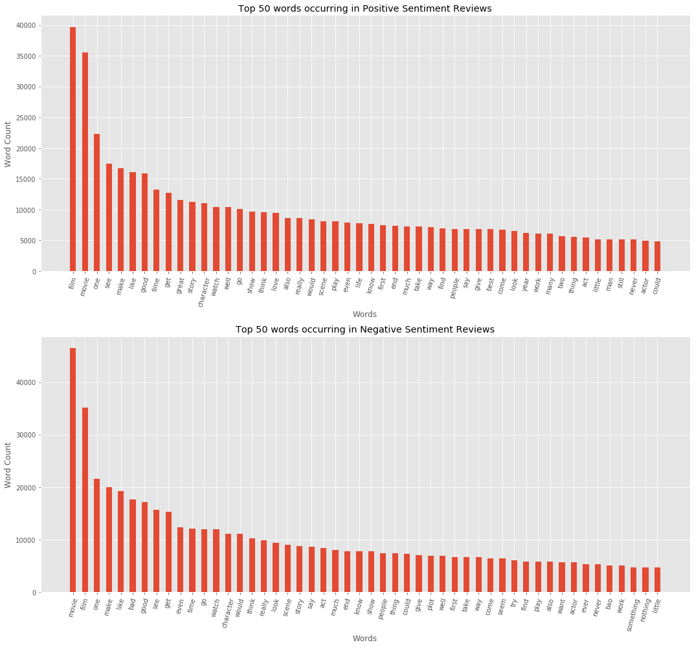
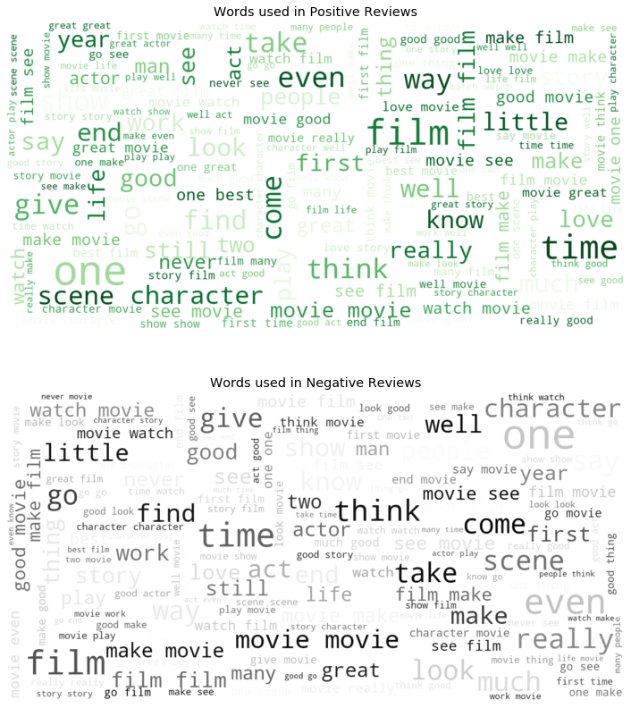

# **Coursework 1: Train a Sentiment Analysis Classifier**
In this course work, you are asked to train a sentiment analysis classifier for movie reviews. The sample code below builds a simple classifier that uses tf-idf to vectorize text and a logistic regression model to make predictions.

## **Table of Contents**

 1. [Introduction](#1)


 2. [Cleaning](#2)  
 
      i. [Removing Punctuations](#2a)  
      ii [Removing Stop Words](#2b)  


 3. [Normalizing](#3)  
 
    ii. [Stemming](#3a)  
    iii. [Lemmatization](#3b)  


 4. [Initial Analysis](#4)  
 
 

 5. [Vectorizer](#5)
 
     i. [Train-Text Split](#5a)  
     ii. [Tf-Idf Vectorizer](#5b)


 6. [Feature Engineering](#6)  


 7. [Final Model Build](#7)

<a id="1"></a>
## **1. Introduction**

This purpose of this assignment is to build a sentiment analysis classifier for movie reviews, which can take a piece of movie review as input and predicts the overall sentiment (positive or negative). This report explains the analysis of the dataset, the feature seleections method and final model building procedure using one of many algorithms. The overall process is implemented in Python.


```python
# Initital imports required for this Courserwork
import numpy as np
import pandas as pd
import random
random.seed(123518)
import re
import pickle
import string
import nltk
import spacy
import itertools

from nltk.stem import PorterStemmer
from nltk.stem import WordNetLemmatizer
from nltk import FreqDist
from nltk.corpus import stopwords
from nltk.tokenize import sent_tokenize

from spacy.lang.en.stop_words import STOP_WORDS
from sklearn.preprocessing import MinMaxScaler
from sklearn.feature_extraction.text import TfidfVectorizer
from sklearn.linear_model import LogisticRegression
from sklearn.naive_bayes import GaussianNB
from sklearn.metrics import precision_recall_fscore_support,accuracy_score
import spacy
import en_core_web_sm
nlp = en_core_web_sm.load()
import warnings
warnings.filterwarnings('ignore')

from wordcloud import WordCloud, STOPWORDS, ImageColorGenerator
import matplotlib.pyplot as plt
%matplotlib inline
plt.style.use('ggplot')

from tqdm import trange, tqdm
tqdm.pandas()
```

After loading the *coursework1_train.csv* file initial overview shows us that there are 2 columns in the dataset.  


**text** column which is a review of a particular movie  
**sentiment** column which tells us that the corresponding review is a positive or a negative review.  
        
        'pos' --> positive review  
        'neg' --> negative review  


```python
raw_data = pd.read_csv('coursework1_train.csv', index_col=0, dtype=str)
raw_data.head()
```


<div>
<style scoped>
    .dataframe tbody tr th:only-of-type {
        vertical-align: middle;
    }

    .dataframe tbody tr th {
        vertical-align: top;
    }

    .dataframe thead th {
        text-align: right;
    }
</style>
<table border="1" class="dataframe">
  <thead>
    <tr style="text-align: right;">
      <th></th>
      <th>text</th>
      <th>sentiment</th>
    </tr>
  </thead>
  <tbody>
    <tr>
      <th>0</th>
      <td>Enjoy the opening credits. They're the best th...</td>
      <td>neg</td>
    </tr>
    <tr>
      <th>1</th>
      <td>Well, the Sci-Fi channel keeps churning these ...</td>
      <td>neg</td>
    </tr>
    <tr>
      <th>2</th>
      <td>It takes guts to make a movie on Gandhi in Ind...</td>
      <td>pos</td>
    </tr>
    <tr>
      <th>3</th>
      <td>The Nest is really just another 'nature run am...</td>
      <td>neg</td>
    </tr>
    <tr>
      <th>4</th>
      <td>Waco: Rules of Engagement does a very good job...</td>
      <td>pos</td>
    </tr>
  </tbody>
</table>
</div>


```python
raw_data.info()
```

    <class 'pandas.core.frame.DataFrame'>
    Int64Index: 40000 entries, 0 to 39999
    Data columns (total 2 columns):
    text         40000 non-null object
    sentiment    40000 non-null object
    dtypes: object(2)
    memory usage: 937.5+ KB


```python
raw_data['sentiment'].value_counts().reset_index()
```


<div>
<style scoped>
    .dataframe tbody tr th:only-of-type {
        vertical-align: middle;
    }

    .dataframe tbody tr th {
        vertical-align: top;
    }

    .dataframe thead th {
        text-align: right;
    }
</style>
<table border="1" class="dataframe">
  <thead>
    <tr style="text-align: right;">
      <th></th>
      <th>index</th>
      <th>sentiment</th>
    </tr>
  </thead>
  <tbody>
    <tr>
      <th>0</th>
      <td>pos</td>
      <td>20000</td>
    </tr>
    <tr>
      <th>1</th>
      <td>neg</td>
      <td>20000</td>
    </tr>
  </tbody>
</table>
</div>


The dataset contains equal number of positive and negative sentiments i.e. 2000 examples for each.  
Looking at some random examples to understand the dataset


```python
ri = [13378, 17961, 5729]

for i in range(len(ri)):
    print('Movie Review Number: {}'.format(ri[i]))
    print('-'*26)
    print(raw_data['text'][ri[i]])
    print('\n')
```

    Movie Review Number: 13378
    --------------------------
    This extraordinary pseudo-documentary, made in 1971, perfectly captures the zeitgeist of America today...which makes it all the more scary and relevant. "subversives" (college students, hippies, black activists, academics) are being rounded up by the government and given lengthy prison terms for what amount to thought crimes and social protest. As an alternative to life in prison, these convicted "criminals" are offered three days in "Punishment Park". Their objective inside the park is to make their way to the American flag where freedom awaits them. Not surprisingly, the Punishment Park option is a dirty lie. This brilliant film from Peter Watkins even pre-dates "Battle Royale" and "Series 7", though its angle of attack is more blatantly political. Shot in '71, it looks and feels as fresh as anything made today. The performances are exemplary and the direction is razer sharp. The narrative cuts back and forth between various groups trying to survive the harsh conditions of the park and the McCarthy-like trials that convicted them. Today, this film still retains its power. In '71, there was nothing but nothing quite like it. This is a masterpiece that succeeds on a dozen levels. It has the balls that most people today have lost.
    
    
    Movie Review Number: 17961
    --------------------------
    What a waste of time to watch this movie. Poor picture quality, poor sound, poor acting and definitely not based on actual facts. The deputy's "girlfriend" did so much overacting, as did the sheriff, that it was more comedy than horror. The deputy tries to make an emergency phone call by dialing 911...PROBLEM...in 1957 that emergency number was not in existence. That is just one example of glaring inconsistencies.<br /><br />The "scary" aspect was way underdone. Just did not come across as horrific.<br /><br />I did think that the actor playing Gein did the most admirable acting job in the whole movie. I could well see mental disturbances in his character portrayal.<br /><br />Sorry...this one just does NOT get it!!
    
    
    Movie Review Number: 5729
    --------------------------
    Incredibly, "Vampire Assassin" is significantly worse than such atrocities as "Tequila Body Shots" and "Zombie Nation" - and those movies are TERRIBLE. Writer/director/star Ron Hall is devoid of both charisma and acting ability, and is also clearly incapable of the most basic directorial concepts. Possibly the worst camera-work, editing, lighting, sound, visual effects, music and fight choreography I have ever seen in a movie. Rarely do two shots cut together, nor can you see much in the beyond-dim lighting. The terrible dialogue is spoken extremely slowly by a supremely untalented cast, stretching the movie to a near-deadly 87 minutes. This is a truly laughable embarrassment for everyone involved. Obviously, aficionados of terrible film-making will want to see this, but it's very hard to sit through no matter how experienced a bad-movie viewer you are. The fact that Ron Hall thought this was actually releasable is astounding. If you are a movie director, and you actually think it's OK for the opening credits of your movie to include a few frames of the words SLUG before the title appears, left over from your rough edit - and you apparently can't muster the energy to edit those frames out - then your standards are obviously so low as to be insulting. I am astounded that Lions Gate/Maple agreed to release this movie on DVD. In spite of Rudy Ray Moore's very brief cameo, this movie is a work of supreme self-indulgence on Ron Hall's part - he clearly thinks he is a formidable actor, and must also believe he possesses superior writing and directing skills - but the movie is so unbelievably inept that it's hard to believe he'd actually want people to see it for fear of being brutally excoriated like I'm doing right now. A jaw-dropping, insanely terrible movie. I'm not kidding.
    
    


From the above 3 examples chosen at random, we can see that a review has mix of below combinations:   
 
* capitalized and lowercase words,<br/>*e.g.: "This extraordinary pseudo-documentary"*  
* there are words written in uppercase,<br/>*e.g.: 'PROBLEM', 'SLUG'*   
* certain proper nouns are written within quotes,<br/>*e.g.: "Vampire Asssasin", "Zombie Nation"*    
* different html tags are present,<br/>*e.g.: "< b r />*    
* basic punctuations<br/>*e.g.: ,.'?!*  
* other redundant symbols<br/>*e.g. */\  ...*   


The general approach of text processing are as follows:

- Cleaning
    - Removing Punctuations
    - Removing Stop Words
- Normalizing
    - Lower Casing
    - Stemming
    - Lemmatization

All the above process will be implemented and performance checked with respect to two algorithms.<br/>For the purpose of this coursework we are going to look into **Naive Bayes** and **Logistic Regression** only as they are one the classical classification algorithms and also effective.

<a id="2"></a>
## **2. Cleaning**
- The process of remove useless information from the text before starting analysis and modelling comes under the ***'Cleaning'*** step.
- In order to perform cleaning, first the text is to be ***tokenized***. Tokenization is the process of splitting sentences into their constituents, which are known as tokens. In English, tokens correspond to words and numeric sequences separated  by white-space characters or punctuation.
- There can 2 types of tokenization.
    - Scentence Tokenization
    - Word Tokenization
- In this dataset all the movie review are present in English and hence we are going to follow the word tokenization process where the text is split into tokens at white-space characters.


<a id="2a"></a>
### **i. Removing Punctuations**  

There can be several approaches to clean the text from unwanted symbols using regex.  
1. Iterate through the tokenize texts and apply the regex to substitute the punctuations and unwanted symbols with white-spaces.
2. Apply a regex pattern to extract only english alphabets from the bunch of text.

The first process is a time consuming process as it requires multiple number of iterations to implement it successfully. The second process is a much faster one as it can extract the texts from the whole corpus in much less time.  
In this coursework the second process is implemented.  

An example text showing the status of the text ***Before*** and ***After*** Cleaning process is shown below:


```python
def regex_cleaner(text):
    cleaner = r"(\\)|(x\d\d)|(<br \/>)|( - )|( -- )|(\[)|(\])|(-)"
    text = re.sub(r'\.\.\.', ' ', text)
    text = re.sub(r'\.\.', ' ', text)
    text = re.sub(r' \. ', '. ', text)
    text = re.sub(r'\.', '. ', text)
    text = re.sub(cleaner, ' ' ,text)
    return text

def tokenize_text(text):
    nlp = spacy.load('en')
    doc = nlp(text)
    return [str(i) for i in doc]

def cleaner(text):
    
    doc = pd.Series(text.split())
    doc = doc[~doc.apply(str.lower).isin(list(string.punctuation))]
    doc = doc.apply(lambda x: re.sub(r'(,)|(:)|(!)|( )|(\()|(\))|(\")|(\?)',' ', x.strip().lower()))
    doc = doc.apply(lambda x: re.sub(r'(\')', '', x.strip().lower()))
    doc = doc[~doc.apply(str.lower).isin(list(string.punctuation))]
    doc = doc[~doc.apply(str.lower).isin([' ', '  ', '   '])]
    doc = doc.apply(lambda x: re.sub(' +', ' ', x))
    return ' '.join(list(doc))

def word_extract(text):
    text = re.findall(r'[A-Za-z]+[\w^\']*', text.lower())
    text = [i for i in text if i != 'br']
    return text

def sent_cleaner(text):
    doc = []
    for i in sent_tokenize(text):
        i = regex_cleaner(i)
        i = cleaner(i)
        doc.append(i)
    return ' '.join(doc)

def stem_words(text):
    p_stem = PorterStemmer()
    return [p_stem.stem(word=i) for i in text]

def lemmer(text):
    
    wordnet_lemmatizer = WordNetLemmatizer()
    doc = pd.Series(text)
    doc = doc.apply(wordnet_lemmatizer.lemmatize, args=('n'))
    doc = doc.apply(wordnet_lemmatizer.lemmatize, args=('v'))
    doc = doc.apply(wordnet_lemmatizer.lemmatize, args=('a'))
    
    return list(doc)
#--------------------------------------------------------------------------------------------------#
print('Before Cleaning')
print('-'*15)
print(raw_data['text'][83])
print('\n')
print('After Cleaning')
print('-'*15)
print(' '.join(word_extract(raw_data['text'][83])))

raw_data['cleaned'] = raw_data['text'].apply(word_extract)
```

    Before Cleaning
    ---------------
    Wow. I just saw Demon Wind a little while ago, and I don't think I'll ever be the same. It has the power to inspire nightmares, but for all the wrong reasons, actually.<br /><br />Never before has humanity seen such a gratuitous change in make-up, for no damn reason. Or, similarly, so much bad zombie (?) makeup that makes you hungry for those Halloween green marshmallows.<br /><br />Or so much naked old lady, for that matter. But then, there was "The Shining."<br /><br />The plot here is so amateurish that it actually almost holds a little bit of charm, as does the dialog. The last shot of the film is just so silly that its beyond description. It's like some drunk college student got together with some pals and decided to throw Bruce Willis type dialog together with (I guess?) teenybopper dialog from some Elm Street film. The result is jarring, and it'd be truly funny if it was intended that way.<br /><br />Ah, what the hey. I'll laugh anyway.<br /><br />Hell, get together with your friends and watch this. But make absolutely sure you're drunk first. Or, you may go insane. Particularly if you're a college film student.<br /><br />Cheers.
    
    
    After Cleaning
    ---------------
    wow i just saw demon wind a little while ago and i don't think i'll ever be the same it has the power to inspire nightmares but for all the wrong reasons actually never before has humanity seen such a gratuitous change in make up for no damn reason or similarly so much bad zombie makeup that makes you hungry for those halloween green marshmallows or so much naked old lady for that matter but then there was the shining the plot here is so amateurish that it actually almost holds a little bit of charm as does the dialog the last shot of the film is just so silly that its beyond description it's like some drunk college student got together with some pals and decided to throw bruce willis type dialog together with i guess teenybopper dialog from some elm street film the result is jarring and it'd be truly funny if it was intended that way ah what the hey i'll laugh anyway hell get together with your friends and watch this but make absolutely sure you're drunk first or you may go insane particularly if you're a college film student cheers


- All the words are extracted successfully without the punctuations. Combined words like *I'll, don't, it's* etc. are also extracted keeping the apostrophe.  
- All the text is also converted into lowercase to avoid duplicate vocabulary in our corpus.

<a id="2b"></a>
### **ii. Removing Stop Words**
There are a several libraries which provides a corpus of ***Stop-Words***. NLTK and Spacy are one of the most popular ones.  
Below are the features of the NLTK and Spacy stopwords.


```python
print('Number of Stop-Words present in the NLTK stopwords list: {}'.format(len(stopwords.words('english'))))
print('Number of Stop-Words present in the Spacy stopwords list: {}'.format(len(STOP_WORDS)))
```

    Number of Stop-Words present in the NLTK stopwords list: 179
    Number of Stop-Words present in the Spacy stopwords list: 326


As the purpose of the coursework is analyzing the sentiment of the review sometimes it can be necessary to remove a few stop-words or not to remove the stopwords at all.  
For our case, both the stop-words corpus will be implemented and evaluated in order to measure the performance.


```python
def sw_remover(text, nltk=True, spacy=False):
    nltk_sw = stopwords.words('english')
    spacy_sw = STOP_WORDS
    if nltk:
        text = [i for i in text if i not in nltk_sw]
        return text
    elif spacy:
        text = [i for i in text if i not in spacy_sw]
        return text
```


```python
print('Before Stop-Words removal review size {}:'.format(len(raw_data['cleaned'][0])))
print('-'*42)
print(' '.join(raw_data['cleaned'][0]))
```

    Before Stop-Words removal review size 287:
    ------------------------------------------
    enjoy the opening credits they're the best thing about this second rate but inoffensive time killer which features passable performances from the likes of eric roberts and martin kove the main part however goes to newcomer tommy lee thomas who looks a bit diminutive for this kind of action but who nevertheless occasionally manages to project a banty rooster kind of belligerence the first time we see him he's bare chested sweaty and engaged in that favorite beefcake activity chopping wood after this he has seven more scenes without his shirt including one in which he's hanged by his wrists and zapped with electricity a la mel gibson in lethal weapon he could use a better script however since the manner in which he exposes the truth about corruption and violence inside the prison is never very convincing there's also talk about millions of dollars which apparently is tied in with this investigation but which is never explained there are a few pluses though sending john woodrow undercover as john wilson is an amusing play on a presidential name and co star jody ross nolan shows promise as an inmate who early in the proceedings is shown hanged by his wrists and getting punched by a burly guard one final note the movie's low budget is painfully responsible for the lack of extras despite the impressive size of the prison it only seems to hold about inmates note the cast credits at the end aren't too helpful for the record the burly bald headed guard who uses jody nolan as a punching bag is played by bill fishback and the young fair haired guard who administers electric shocks to tommy lee thomas is played by marc chenail


```python
z = sw_remover(raw_data['cleaned'][0], nltk=True, spacy=False)
print('After NLTK Stop-Words removal review size {}:'.format(len(z)))
print('-'*47)
print(' '.join(z))
```

    After NLTK Stop-Words removal review size 171:
    -----------------------------------------------
    enjoy opening credits they're best thing second rate inoffensive time killer features passable performances likes eric roberts martin kove main part however goes newcomer tommy lee thomas looks bit diminutive kind action nevertheless occasionally manages project banty rooster kind belligerence first time see he's bare chested sweaty engaged favorite beefcake activity chopping wood seven scenes without shirt including one he's hanged wrists zapped electricity la mel gibson lethal weapon could use better script however since manner exposes truth corruption violence inside prison never convincing there's also talk millions dollars apparently tied investigation never explained pluses though sending john woodrow undercover john wilson amusing play presidential name co star jody ross nolan shows promise inmate early proceedings shown hanged wrists getting punched burly guard one final note movie's low budget painfully responsible lack extras despite impressive size prison seems hold inmates note cast credits end helpful record burly bald headed guard uses jody nolan punching bag played bill fishback young fair haired guard administers electric shocks tommy lee thomas played marc chenail


```python
z = sw_remover(raw_data['cleaned'][0], nltk=False, spacy=True)
print('After Spacy Stop-Words removal review size {}:'.format(len(z)))
print('-'*47)
print(' '.join(z))
```

    After Spacy Stop-Words removal review size 155:
    -----------------------------------------------
    enjoy opening credits they're best thing second rate inoffensive time killer features passable performances likes eric roberts martin kove main goes newcomer tommy lee thomas looks bit diminutive kind action occasionally manages project banty rooster kind belligerence time he's bare chested sweaty engaged favorite beefcake activity chopping wood seven scenes shirt including he's hanged wrists zapped electricity la mel gibson lethal weapon use better script manner exposes truth corruption violence inside prison convincing there's talk millions dollars apparently tied investigation explained pluses sending john woodrow undercover john wilson amusing play presidential co star jody ross nolan shows promise inmate early proceedings shown hanged wrists getting punched burly guard final note movie's low budget painfully responsible lack extras despite impressive size prison hold inmates note cast credits end aren't helpful record burly bald headed guard uses jody nolan punching bag played bill fishback young fair haired guard administers electric shocks tommy lee thomas played marc chenail


```python
raw_data['cleaned_nltk_sw'] = raw_data['cleaned'].apply(sw_remover, args=(True, False))
raw_data['cleaned_spacy_sw'] = raw_data['cleaned'].apply(sw_remover, args=(False, True))
```


We can see that number of words remaining after implementing stop-words removal using Spacy stopwords is comparatively less than that after removal of NLTK. We'll analyze the impact in the next sections.

<a id="3"></a>
## **3. Normalizing**

The process of converting all the texts inthe corpus into it's true root form is text normalization. It is not always necessary to perform text normalization.  
When we are performing sentiment analysis on a large corpus of data performing text normalization will reduce our feature space but can affect the overall performance of the algorithm.  
Both the type of most popular text processing will be implemented and based on the performance the algorithms we'll decide if we need to use text normalization or not.

<a id="3a"></a>
### **i. Stemming**

The process of reducing words to their root forms such as mapping a group of words to the same stem even if  the stem itself is not a valid word in the Language.


```python
raw_data['cleaned_nltk_sw_stemmed'] = raw_data['cleaned_nltk_sw'].apply(stem_words)
raw_data['cleaned_spacy_sw_stemmed'] = raw_data['cleaned_spacy_sw'].apply(stem_words)
```

From the below table we can see a before and after effect of stemming.

| Before Stemming | After Stemming | 
| :--------       | :--------   | 
| discussion |discuss |
| times | time |
| named | name |
| films | film |
| saving | save |
| outstanding | outstand |
| technical | technic |
| message | messag |
| entertaining | entertain |
| movie | movi |
| combines | combin |
| shooting | shoot |

For example, words like outstanding, technical, message are converted to outstand, technic, messag respectively. The root forms are not an actual word which exists in the English language.

<a id="3b"></a>
### **ii. Lemmatization**
Lemmatization process reduces the inflected words properly ensuring that the root word belongs to the language.  
This is a much more costlier process than Stemming as it checks the parts-of-speech of the token and then converts it into it's root form based on the mentioned part-of-speech. It can be either a verb root form, a noun root form or an adjective root form.


```python
raw_data['cleaned_nltk_sw_lemm'] = raw_data['cleaned_nltk_sw'].apply(lemmer)
raw_data['cleaned_spacy_sw_lemm'] = raw_data['cleaned_spacy_sw'].apply(lemmer)
```

The below table shows a before and after situation after implementing Lemmatization. 


| Before Lemmatization    | After Lemmatization | 
| :--------       | :--------   | 
| greatest | great
| times | time
| named | name
| greatest | great
| films | film
| saving | save
| entertaining | entertain
| combines | combine
| shooting | shoot
| things | thing
| starting | start
| civilizations | civilization
| wartimes | wartime
| says | say

From the above table we can see superlative adjectives are converted into their positive root, plurals are converted into their singular form and continuous nouns/verbs are converted into normal noun form.

<a id="4"></a>
## **4. Initial Analysis**  
 
In order to understand the data present at hand we need to perform some basic exploratory analysis. The two types of analysis we are going to perform are as follows:
- *Frequency Analysis*
- *Parts of Speech Analysis*

Both types of analysis will be performed class-wise i.e. with respect to each class label.

<a id="4a"></a>
### **i. Frequency Analysis**

The below 2 bar plots shows us the most occuring words present in the words present in the positive and negative reviews respectively.


```python
pos_words = list(itertools.chain.from_iterable(raw_data[raw_data['sentiment'] == 'pos']['cleaned_nltk_sw_lemm']))
neg_words = list(itertools.chain.from_iterable(raw_data[raw_data['sentiment'] == 'neg']['cleaned_nltk_sw_lemm']))

pos_fd = FreqDist(pos_words)
neg_fd = FreqDist(neg_words)

pos = pd.DataFrame.from_dict(pos_fd, orient='index', columns=['count']).sort_values('count', ascending=False)

neg = pd.DataFrame.from_dict(neg_fd, orient='index', columns=['count']).sort_values('count', ascending=False)

plt.figure(figsize=(15, 14))
plt.subplot(2, 1, 1)
plt.bar(height=pos.head(50)['count'], x=np.arange(50), width=0.5)
plt.xticks(ticks=(np.arange(50)), labels=(pos.head(50).index), rotation=75)
plt.xlabel('Words')
plt.ylabel('Word Count')
plt.title('Top 50 words occurring in Positive Sentiment Reviews')

plt.subplot(2, 1, 2)
plt.bar(height=neg.head(50)['count'], x=np.arange(50), width=0.5)
plt.xticks(ticks=(np.arange(50)), labels=(neg.head(50).index), rotation=75)
plt.xlabel('Words')
plt.ylabel('Word Count')
plt.title('Top 50 words occurring in Negative Sentiment Reviews')

plt.tight_layout()
plt.show();
```


    

    


We can see that there are multiple common words present in both the types of reviews. Let's observe the distribution by removing the common words from both the review set.


```python
pos.reset_index(inplace=True)
neg.reset_index(inplace=True)
sw = pd.merge(pos, neg, how='inner', on='index')['index'].tolist()
pos_words = pd.DataFrame(pos_words, columns=['words'])
pos_words = pos_words[~pos_words['words'].isin(sw[50:])]['words'].apply(lambda x: x.strip()).tolist()
neg_words = pd.DataFrame(neg_words, columns=['words'])
neg_words = neg_words[~neg_words['words'].isin(sw[50:])]['words'].apply(lambda x: x.strip()).tolist()
```


```python
wordcloud = WordCloud(max_font_size=80, max_words=150, width=1200, height=600, colormap='Greens', background_color="white").generate(' '.join(pos_words))
plt.figure(figsize=(20, 14))
plt.subplot(2, 1, 1)
plt.imshow(wordcloud, interpolation="bilinear")
plt.axis("off")
plt.title('Words used in Positive Reviews')
wordcloud = WordCloud(max_font_size=80, max_words=150,  width=1200, height=600, colormap='Greys', background_color="white").generate(' '.join(neg_words))
plt.subplot(2, 1, 2)
plt.imshow(wordcloud, interpolation="bilinear")
plt.axis("off")
plt.title('Words used in Negative Reviews')
plt.show()
plt.tight_layout();
```


    

    


    <Figure size 432x288 with 0 Axes>


We observe the words which are present in either sentiment groups and not present in the top 50 common words between them.
From the above set of word-clouds we can see that there are a few common words which are still prominent, but there are quite a few words which are significant to each sentiment group.

<a id="5"></a>
## **5. Vectorizer**

<a id="5a"></a>
## **i. Train-Text Split**


- The data-set is divided into a train and dev-test set, with 80% of the data in train and 20% of the data in dev-test.  
- We have 40000 documents in the dataset, 35000 is moved into train set and the remaining 5000 is considered as dev-test set.  
- The index of 35000 numbers are randomly generated between 0 and 40000. 
- The remaining indexes which are not present in the generated indexes are considered as the test set.

Below is a set of results which shows us the training and dev-test performance of Logistic Regression and Gaussian Naive Bayes algorithm on 7 different types of processed data with maximum 10,000 features generated using tf-idf vectorizer.  


```python
s = random.sample(range(0, 40000), k=35000)

train_text = raw_data.iloc[s,]['cleaned'].apply(lambda x: ' '.join(x))
train_text_nltk_sw = raw_data.iloc[s,]['cleaned_nltk_sw'].apply(lambda x: ' '.join(x))
train_text_spacy_sw = raw_data.iloc[s,]['cleaned_spacy_sw'].apply(lambda x: ' '.join(x))
train_text_nltk_sw_stemmed = raw_data.iloc[s,]['cleaned_nltk_sw_stemmed'].apply(lambda x: ' '.join(x))
train_text_spacy_sw_stemmed = raw_data.iloc[s,]['cleaned_spacy_sw_stemmed'].apply(lambda x: ' '.join(x))
train_text_nltk_sw_lemm = raw_data.iloc[s,]['cleaned_nltk_sw_lemm'].apply(lambda x: ' '.join(x))
train_text_spacy_sw_lemm = raw_data.iloc[s,]['cleaned_spacy_sw_lemm'].apply(lambda x: ' '.join(x))

test_text = raw_data[~raw_data.index.isin(s)]['cleaned'].apply(lambda x: ' '.join(x))
test_text_nltk_sw = raw_data[~raw_data.index.isin(s)]['cleaned_nltk_sw'].apply(lambda x: ' '.join(x))
test_text_spacy_sw = raw_data[~raw_data.index.isin(s)]['cleaned_spacy_sw'].apply(lambda x: ' '.join(x))
test_text_nltk_sw_stemmed = raw_data[~raw_data.index.isin(s)]['cleaned_nltk_sw_stemmed'].apply(lambda x: ' '.join(x))
test_text_spacy_sw_stemmed = raw_data[~raw_data.index.isin(s)]['cleaned_spacy_sw_stemmed'].apply(lambda x: ' '.join(x))
test_text_nltk_sw_lemm = raw_data[~raw_data.index.isin(s)]['cleaned_nltk_sw_lemm'].apply(lambda x: ' '.join(x))
test_text_spacy_sw_lemm = raw_data[~raw_data.index.isin(s)]['cleaned_spacy_sw_lemm'].apply(lambda x: ' '.join(x))

train_labels = raw_data.iloc[s,]['sentiment']
test_labels = raw_data[~raw_data.index.isin(s)]['sentiment']

print('Training and Testing on only cleaned data set..')
print('*'*50)

max_feature_num = 10000
train_vectorizer = TfidfVectorizer(max_features=max_feature_num, lowercase=True, sublinear_tf=True,
                                   ngram_range=(1, 1))
train_vecs = train_vectorizer.fit_transform(train_text)
test_vecs = train_vectorizer.transform(test_text)

# train model
clf = LogisticRegression()
clf.fit(train_vecs, train_labels.values)

# test model
preds = clf.predict(test_vecs)
acc = accuracy_score(test_labels, preds)
pre, rec, f1, _ = precision_recall_fscore_support(test_labels, preds, average='micro')
print('Logistic Regression')
print('acc', acc)
print('precision', pre)
print('rec', rec)
print('f1', f1)
print('-'*40)

gnb = GaussianNB(var_smoothing=2)
gnb.fit(train_vecs.toarray(), train_labels.values)

# test model
preds = gnb.predict(test_vecs.toarray())

acc = accuracy_score(test_labels, preds)
pre, rec, f1, _ = precision_recall_fscore_support(test_labels, preds, average='micro')
print('GaussianNB')
print('acc', acc)
print('precision', pre)
print('rec', rec)
print('f1', f1)

#########################################################################################################

print('\nTraining and Testing on cleaned data set with stop words removed using NLTK..')
print('*'*50)

max_feature_num = 10000
train_vectorizer = TfidfVectorizer(max_features=max_feature_num, lowercase=True, sublinear_tf=True,
                                   ngram_range=(1, 1))
train_vecs = train_vectorizer.fit_transform(train_text_nltk_sw)
test_vecs = train_vectorizer.transform(test_text_nltk_sw)
# train model
clf = LogisticRegression()
clf.fit(train_vecs, train_labels.values)

# test model
preds = clf.predict(test_vecs)
acc = accuracy_score(test_labels, preds)
pre, rec, f1, _ = precision_recall_fscore_support(test_labels, preds, average='micro')
print('Logistic Regression')
print('acc', acc)
print('precision', pre)
print('rec', rec)
print('f1', f1)
print('-'*40)

gnb = GaussianNB(var_smoothing=2)
gnb.fit(train_vecs.toarray(), train_labels.values)

# test model
preds = gnb.predict(test_vecs.toarray())

acc = accuracy_score(test_labels, preds)
pre, rec, f1, _ = precision_recall_fscore_support(test_labels, preds, average='micro')
print('GaussianNB')
print('acc', acc)
print('precision', pre)
print('rec', rec)
print('f1', f1)

#########################################################################################################

print('\nTraining and Testing on cleaned data set with stop words removed using Spacy..')
print('*'*50)


max_feature_num = 10000
train_vectorizer = TfidfVectorizer(max_features=max_feature_num, lowercase=True, sublinear_tf=True,
                                   ngram_range=(1, 1))
train_vecs = train_vectorizer.fit_transform(train_text_spacy_sw)
test_vecs = train_vectorizer.transform(test_text_spacy_sw)
# train model
clf = LogisticRegression()
clf.fit(train_vecs, train_labels.values)

# test model
preds = clf.predict(test_vecs)
acc = accuracy_score(test_labels, preds)
pre, rec, f1, _ = precision_recall_fscore_support(test_labels, preds, average='micro')
print('Logistic Regression')
print('acc', acc)
print('precision', pre)
print('rec', rec)
print('f1', f1)
print('-'*40)

gnb = GaussianNB(var_smoothing=2)
gnb.fit(train_vecs.toarray(), train_labels.values)

# test model
preds = gnb.predict(test_vecs.toarray())

acc = accuracy_score(test_labels, preds)
pre, rec, f1, _ = precision_recall_fscore_support(test_labels, preds, average='micro')
print('GaussianNB')
print('acc', acc)
print('precision', pre)
print('rec', rec)
print('f1', f1)

#########################################################################################################

print('\nTraining and Testing on cleaned data set with stop words removed using NLTK and stemming..')
print('*'*50)

max_feature_num = 10000
train_vectorizer = TfidfVectorizer(max_features=max_feature_num, lowercase=True, sublinear_tf=True,
                                   ngram_range=(1, 1))
train_vecs = train_vectorizer.fit_transform(train_text_nltk_sw_stemmed)
test_vecs = train_vectorizer.transform(test_text_nltk_sw_stemmed)
# train model
clf = LogisticRegression()
clf.fit(train_vecs, train_labels.values)

# test model
preds = clf.predict(test_vecs)
acc = accuracy_score(test_labels, preds)
pre, rec, f1, _ = precision_recall_fscore_support(test_labels, preds, average='micro')
print('Logistic Regression')
print('acc', acc)
print('precision', pre)
print('rec', rec)
print('f1', f1)
print('-'*40)

gnb = GaussianNB(var_smoothing=2)
gnb.fit(train_vecs.toarray(), train_labels.values)

# test model
preds = gnb.predict(test_vecs.toarray())

acc = accuracy_score(test_labels, preds)
pre, rec, f1, _ = precision_recall_fscore_support(test_labels, preds, average='micro')
print('GaussianNB')
print('acc', acc)
print('precision', pre)
print('rec', rec)
print('f1', f1)

#########################################################################################################

print('\nTraining and Testing on cleaned data set with stop words removed using Spacy and stemming..')
print('*'*50)

max_feature_num = 10000
train_vectorizer = TfidfVectorizer(max_features=max_feature_num, lowercase=True, sublinear_tf=True,
                                   ngram_range=(1, 1))
train_vecs = train_vectorizer.fit_transform(train_text_spacy_sw_stemmed)
test_vecs = train_vectorizer.transform(test_text_spacy_sw_stemmed)
# train model
clf = LogisticRegression()
clf.fit(train_vecs, train_labels.values)

# test model
preds = clf.predict(test_vecs)
acc = accuracy_score(test_labels, preds)
pre, rec, f1, _ = precision_recall_fscore_support(test_labels, preds, average='micro')
print('Logistic Regression')
print('acc', acc)
print('precision', pre)
print('rec', rec)
print('f1', f1)
print('-'*40)

gnb = GaussianNB(var_smoothing=2)
gnb.fit(train_vecs.toarray(), train_labels.values)

# test model
preds = gnb.predict(test_vecs.toarray())

acc = accuracy_score(test_labels, preds)
pre, rec, f1, _ = precision_recall_fscore_support(test_labels, preds, average='micro')
print('GaussianNB')
print('acc', acc)
print('precision', pre)
print('rec', rec)
print('f1', f1)

#########################################################################################################

print('\nTraining and Testing on cleaned data set with stop words removed using NLTK and lemmatization..')
print('*'*50)

max_feature_num = 10000
train_vectorizer = TfidfVectorizer(max_features=max_feature_num, lowercase=True, sublinear_tf=True,
                                   ngram_range=(1, 1))
train_vecs = train_vectorizer.fit_transform(train_text_nltk_sw_lemm)
test_vecs = train_vectorizer.transform(test_text_nltk_sw_lemm)
# train model
clf = LogisticRegression()
clf.fit(train_vecs, train_labels.values)

# test model
preds = clf.predict(test_vecs)
acc = accuracy_score(test_labels, preds)
pre, rec, f1, _ = precision_recall_fscore_support(test_labels, preds, average='micro')
print('Logistic Regression')
print('acc', acc)
print('precision', pre)
print('rec', rec)
print('f1', f1)
print('-'*40)

gnb = GaussianNB(var_smoothing=2)
gnb.fit(train_vecs.toarray(), train_labels.values)

# test model
preds = gnb.predict(test_vecs.toarray())

acc = accuracy_score(test_labels, preds)
pre, rec, f1, _ = precision_recall_fscore_support(test_labels, preds, average='micro')
print('GaussianNB')
print('acc', acc)
print('precision', pre)
print('rec', rec)
print('f1', f1)


#########################################################################################################

print('\nTraining and Testing on cleaned data set with stop words removed using Spacy and lemmatization..')
print('*'*50)

max_feature_num = 10000
train_vectorizer = TfidfVectorizer(max_features=max_feature_num, lowercase=True, sublinear_tf=True,
                                   ngram_range=(1, 1))
train_vecs = train_vectorizer.fit_transform(train_text_spacy_sw_lemm)
test_vecs = train_vectorizer.transform(test_text_spacy_sw_lemm)
# train model
clf = LogisticRegression()
clf.fit(train_vecs, train_labels.values)

# test model
preds = clf.predict(test_vecs)
acc = accuracy_score(test_labels, preds)
pre, rec, f1, _ = precision_recall_fscore_support(test_labels, preds, average='micro')
print('Logistic Regression')
print('acc', acc)
print('precision', pre)
print('rec', rec)
print('f1', f1)
print('-'*40)

gnb = GaussianNB(var_smoothing=2)
gnb.fit(train_vecs.toarray(), train_labels.values)

# test model
preds = gnb.predict(test_vecs.toarray())

acc = accuracy_score(test_labels, preds)
pre, rec, f1, _ = precision_recall_fscore_support(test_labels, preds, average='micro')
print('GaussianNB')
print('acc', acc)
print('precision', pre)
print('rec', rec)
print('f1', f1)
```

    Training and Testing on only cleaned data set..
    **************************************************
    Logistic Regression
    acc 0.8916
    precision 0.8916
    rec 0.8916
    f1 0.8916
    ----------------------------------------
    GaussianNB
    acc 0.7538
    precision 0.7538
    rec 0.7538
    f1 0.7537999999999999
    
    Training and Testing on cleaned data set with stop words removed using NLTK..
    **************************************************
    Logistic Regression
    acc 0.8936
    precision 0.8936
    rec 0.8936
    f1 0.8936
    ----------------------------------------
    GaussianNB
    acc 0.8176
    precision 0.8176
    rec 0.8176
    f1 0.8176
    
    Training and Testing on cleaned data set with stop words removed using Spacy..
    **************************************************
    Logistic Regression
    acc 0.8938
    precision 0.8938
    rec 0.8938
    f1 0.8938
    ----------------------------------------
    GaussianNB
    acc 0.82
    precision 0.82
    rec 0.82
    f1 0.82
    
    Training and Testing on cleaned data set with stop words removed using NLTK and stemming..
    **************************************************
    Logistic Regression
    acc 0.8904
    precision 0.8904
    rec 0.8904
    f1 0.8904
    ----------------------------------------
    GaussianNB
    acc 0.8182
    precision 0.8182
    rec 0.8182
    f1 0.8182000000000001
    
    Training and Testing on cleaned data set with stop words removed using Spacy and stemming..
    **************************************************
    Logistic Regression
    acc 0.8912
    precision 0.8912
    rec 0.8912
    f1 0.8912
    ----------------------------------------
    GaussianNB
    acc 0.8192
    precision 0.8192
    rec 0.8192
    f1 0.8191999999999999
    
    Training and Testing on cleaned data set with stop words removed using NLTK and lemmatization..
    **************************************************
    Logistic Regression
    acc 0.8932
    precision 0.8932
    rec 0.8932
    f1 0.8932
    ----------------------------------------
    GaussianNB
    acc 0.8078
    precision 0.8078
    rec 0.8078
    f1 0.8078
    
    Training and Testing on cleaned data set with stop words removed using Spacy and lemmatization..
    **************************************************
    Logistic Regression
    acc 0.8932
    precision 0.8932
    rec 0.8932
    f1 0.8932
    ----------------------------------------
    GaussianNB
    acc 0.8082
    precision 0.8082
    rec 0.8082
    f1 0.8082


According to the above set of results, Logistic Regression performs better in all the cases compared to Naive Bayes.  
Also, we can see that normalization process of removing stop-wrods, stemming and lemmatization is not giving us a good performance.  
So, we are going to continue our sentiment analysis using only the cleaned version of the data without any normalization.

<a id="5b"></a>
## **ii. Tf-Idf Vectorizer**

- Tf-Idf Vectorizer is an sklearn package which creates a vector representation of the vocabulary corpus i.e features. 
- Using the vector representation we can train different algorithms to serve our purpose. 
- The above set of results are created by using the default configuration of the tf-idf vectorizer.
- There are different parameters of the vectorizer and we will see in the below feature engineering section how to generate and build different types of feature vectors.

<a id="6"></a>
## **6. Feature Selection**

There are different ways of feature engineering. We are going to look into the Feautre Importance using Trees.

- The number of features are selected from the feature importance array by keeping only the top 75% features
- By running a feature importance using Extra-Tree Classifier on 5000 trees, we can see that there's a significant decrease in the training accuracy.  
- When tested against the dev-test set the accuracy, precision as well as recall is has also reduced compared to our base-line 89%.


```python
s = random.sample(range(0, 40000), k=35000)

train_text = raw_data.iloc[s,]['cleaned'].apply(lambda x: ' '.join(x))
test_text = raw_data[~raw_data.index.isin(s)]['cleaned'].apply(lambda x: ' '.join(x))

train_labels = raw_data.iloc[s,]['sentiment']
test_labels = raw_data[~raw_data.index.isin(s)]['sentiment']
```


```python
tf_idf = TfidfVectorizer(max_features=10000, analyzer='word', encoding='utf-8', lowercase=True, sublinear_tf=True, use_idf=True)
train_vecs = tf_idf.fit_transform(train_text)

from sklearn.model_selection import cross_val_score
from sklearn.ensemble import ExtraTreesClassifier

forest = ExtraTreesClassifier(n_estimators=5000, random_state=0, verbose=2, n_jobs=10)

forest.fit(train_vecs, train_labels)
importances = forest.feature_importances_
std = np.std([tree.feature_importances_ for tree in forest.estimators_], axis=0)
indices = np.argsort(importances)[::-1]

# Print the feature ranking
print("Feature ranking:")
f_imp = pd.DataFrame([(indices[f], importances[indices[f]]) for f in range(train_vecs.shape[1])], columns=['feature_index', 'importance'])
f_imp.head(10)

f_imp[['importance']].describe()

selected_features = list(f_imp[f_imp['importance'] > 0.00075]['feature_index'].values)
```


```python
train_vecs = train_vecs[:,selected_features]

clf = LogisticRegression(verbose=1, max_iter=200000, n_jobs=-2)
clf.fit(train_vecs, train_labels)
print('Train Acc.:', accuracy_score(train_labels, clf.predict(train_vecs)))
```

    [Parallel(n_jobs=-2)]: Using backend LokyBackend with 11 concurrent workers.


    Train Acc.: 0.8472285714285714


    [Parallel(n_jobs=-2)]: Done   1 out of   1 | elapsed:    0.9s finished


```python
test_vecs = tf_idf.transform(test_text)
test_vecs = test_vecs[:,selected_features]

preds = clf.predict(test_vecs)

acc = accuracy_score(test_labels, preds)
pre, rec, f1, _ = precision_recall_fscore_support(test_labels, preds, average='micro')
print('Result on Dev-Test set')
print('-'*23)
print('acc', acc)
print('precision', pre)
print('rec', rec)
print('f1', f1)
```

    Result on Dev-Test set
    -----------------------
    acc 0.8234
    precision 0.8234
    rec 0.8234
    f1 0.8234


- We were trying to build our logisitic regression model based on a very specific combination of Tf-Idf vectorizer and Logisitic Regression parameters.  
- We'll increase the number of features and also perform variations on the parameters of the Tf-Idf vectorizer as well as Logistic Regression.  
- Based on the best performing model, we'll finally train an algorithm by training it on the while training set.


- The prime focus will be on capturing the sequence of words.
- In order to do so, the number of n-grams in the tf-idf is to be increased.
- When the number of n-grams is increased, the number of max-features should also be increased.
- The penalty term of the Logistic Regression function should be increased at the same time.

#### Combination -1
---
1. **Tf-Idf Parameters**  
    - Number of Features = 70000  
    - Min Document Frequency = 5  
    - Maximum Document Frequency = 0.8 x 40000  
    - Analyzer = word  
    - Sublinear TF = True  
    - Use IDF = True  
    - n_grams = 1


2. **Logistic Regression Parameters**  
    - Solver = newton-cg  
    - Penalty = l2  
    - C = 3  


```python
max_feature_num = 70000
train_vectorizer = TfidfVectorizer(max_features=max_feature_num, analyzer='word', encoding='utf-8',
                                   ngram_range=(1, 1), min_df=5, max_df=0.8*40000, lowercase=True,
                                   sublinear_tf=True, use_idf=True)
train_vecs = train_vectorizer.fit_transform(train_text)
```


```python
clf = LogisticRegression(C = 3, max_iter=250, n_jobs=10, solver='newton-cg', penalty='l2')
clf.fit(train_vecs, train_labels)
```


    LogisticRegression(C=3, class_weight=None, dual=False, fit_intercept=True,
                       intercept_scaling=1, l1_ratio=None, max_iter=250,
                       multi_class='auto', n_jobs=10, penalty='l2',
                       random_state=None, solver='newton-cg', tol=0.0001, verbose=0,
                       warm_start=False)


```python
print('Train Acc.:', accuracy_score(train_labels, clf.predict(train_vecs)))
```

    Train Acc.: 0.9572571428571428


```python
test_vecs = train_vectorizer.transform(test_text)

preds = clf.predict(test_vecs)

acc = accuracy_score(test_labels, preds)
pre, rec, f1, _ = precision_recall_fscore_support(test_labels, preds, average='micro')
print('Result on Dev-Test set')
print('-'*23)
print('acc', acc)
print('precision', pre)
print('rec', rec)
print('f1', f1)
```

    Result on Dev-Test set
    -----------------------
    acc 0.8992
    precision 0.8992
    rec 0.8992
    f1 0.8992000000000001


#### Combination - 2
---
1. **Tf-Idf Parameters**  
    - Number of Features = 100000  
    - Min Document Frequency = 5  
    - Maximum Document Frequency = 0.8 x 40000  
    - Analyzer = word  
    - Sublinear TF = True  
    - Use IDF = True  
    - n_grams = 1, 2


2. **Logistic Regression Parameters**  
    - Solver = newton-cg  
    - Penalty = l2  
    - C = 5  


```python
max_feature_num = 100000
train_vectorizer = TfidfVectorizer(max_features=max_feature_num, analyzer='word', encoding='utf-8',
                                   ngram_range=(1, 2), min_df=5, max_df=0.8*40000, lowercase=True,
                                   sublinear_tf=True, use_idf=True)
train_vecs = train_vectorizer.fit_transform(train_text)
```


```python
clf = LogisticRegression(C = 5, max_iter=250, n_jobs=10, solver='sag', penalty='l2')
clf.fit(train_vecs, train_labels)
```


    LogisticRegression(C=5, class_weight=None, dual=False, fit_intercept=True,
                       intercept_scaling=1, l1_ratio=None, max_iter=250,
                       multi_class='auto', n_jobs=10, penalty='l2',
                       random_state=None, solver='sag', tol=0.0001, verbose=0,
                       warm_start=False)


```python
print('Train Acc.:', accuracy_score(train_labels, clf.predict(train_vecs)))
```

    Train Acc.: 0.9898


```python
test_vecs = train_vectorizer.transform(test_text)

preds = clf.predict(test_vecs)

acc = accuracy_score(test_labels, preds)
pre, rec, f1, _ = precision_recall_fscore_support(test_labels, preds, average='micro')
print('Result on Dev-Test set')
print('-'*23)
print('acc', acc)
print('precision', pre)
print('rec', rec)
print('f1', f1)
```

    Result on Dev-Test set
    -----------------------
    acc 0.9126
    precision 0.9126
    rec 0.9126
    f1 0.9126


#### Combination - 3
---
1. **Tf-Idf Parameters**  
    - Number of Features = 200000  
    - Min Document Frequency = 5  
    - Maximum Document Frequency = 0.8 x 40000  
    - Analyzer = word  
    - Sublinear TF = True  
    - Use IDF = True  
    - n_grams = 1, 3


2. **Logistic Regression Parameters**  
    - Solver = newton-cg  
    - Penalty = l2  
    - C = 8  


```python
max_feature_num = 200000
train_vectorizer = TfidfVectorizer(max_features=max_feature_num, analyzer='word', encoding='utf-8',
                                   ngram_range=(1, 3), min_df=5, max_df=0.8*40000, lowercase=True,
                                   sublinear_tf=True, use_idf=True)
train_vecs = train_vectorizer.fit_transform(train_text)
```


```python
clf = LogisticRegression(max_iter=250, n_jobs=10, solver='sag', penalty='l2')
clf.fit(train_vecs, train_labels)
```


    LogisticRegression(C=1.0, class_weight=None, dual=False, fit_intercept=True,
                       intercept_scaling=1, l1_ratio=None, max_iter=250,
                       multi_class='auto', n_jobs=10, penalty='l2',
                       random_state=None, solver='sag', tol=0.0001, verbose=0,
                       warm_start=False)


```python
print('Train Acc.:', accuracy_score(train_labels, clf.predict(train_vecs)))
```

    Train Acc.: 0.9553714285714285


```python
test_vecs = train_vectorizer.transform(test_text)

preds = clf.predict(test_vecs)

acc = accuracy_score(test_labels, preds)
pre, rec, f1, _ = precision_recall_fscore_support(test_labels, preds, average='micro')
print('Result on Dev-Test set')
print('-'*23)
print('acc', acc)
print('precision', pre)
print('rec', rec)
print('f1', f1)
```

    Result on Dev-Test set
    -----------------------
    acc 0.904
    precision 0.904
    rec 0.904
    f1 0.904


#### Combination - 4
----
1. **Tf-Idf Parameters**  
    - Number of Features = 350000  
    - Min Document Frequency = 5  
    - Maximum Document Frequency = 0.8 x 40000  
    - Analyzer = word  
    - Sublinear TF = True  
    - Use IDF = True  
    - n_grams = 1, 4


2. **Logistic Regression Parameters**  
    - Solver = newton-cg  
    - Penalty = l2  
    - C = 15  


```python
max_feature_num = 350000
train_vectorizer = TfidfVectorizer(max_features=max_feature_num, analyzer='word', encoding='utf-8',
                                   ngram_range=(1, 4), min_df=5, max_df=0.8*80000, lowercase=True,
                                   sublinear_tf=True, use_idf=True)
train_vecs = train_vectorizer.fit_transform(train_text)
```


```python
clf = LogisticRegression(C = 15.75, max_iter=250, n_jobs=10, solver='sag', penalty='l2')
clf.fit(train_vecs, train_labels)
```


    LogisticRegression(C=15.75, class_weight=None, dual=False, fit_intercept=True,
                       intercept_scaling=1, l1_ratio=None, max_iter=250,
                       multi_class='auto', n_jobs=10, penalty='l2',
                       random_state=None, solver='sag', tol=0.0001, verbose=0,
                       warm_start=False)


```python
print('Train Acc.:', accuracy_score(train_labels, clf.predict(train_vecs)))
```

    Train Acc.: 0.9998857142857143


```python
test_vecs = train_vectorizer.transform(test_text)

preds = clf.predict(test_vecs)

acc = accuracy_score(test_labels, preds)
pre, rec, f1, _ = precision_recall_fscore_support(test_labels, preds, average='micro')
print('Result on Dev-Test set')
print('-'*23)
print('acc', acc)
print('precision', pre)
print('rec', rec)
print('f1', f1)
```

    Result on Dev-Test set
    -----------------------
    acc 0.9132
    precision 0.9132
    rec 0.9132
    f1 0.9132


#### Combination - 5
---
1. **Tf-Idf Parameters**  
    - Number of Features = 350000  
    - Min Document Frequency = 5  
    - Maximum Document Frequency = 0.8 x 40000  
    - Analyzer = word  
    - Sublinear TF = True  
    - Use IDF = True  
    - n_grams = 1, 5


2. **Logistic Regression Parameters**  
    - Solver = newton-cg  
    - Penalty = l2  
    - C = 15  


```python
max_feature_num = 350000
train_vectorizer = TfidfVectorizer(max_features=max_feature_num, analyzer='word', encoding='utf-8',
                                   ngram_range=(1, 5), min_df=5, max_df=0.8*80000, lowercase=True,
                                   sublinear_tf=True, use_idf=True)
train_vecs = train_vectorizer.fit_transform(train_text)
```


```python
clf = LogisticRegression(C = 15.75, max_iter=250, n_jobs=10, solver='sag', penalty='l2')
clf.fit(train_vecs, train_labels)
```


    LogisticRegression(C=15.75, class_weight=None, dual=False, fit_intercept=True,
                       intercept_scaling=1, l1_ratio=None, max_iter=250,
                       multi_class='auto', n_jobs=10, penalty='l2',
                       random_state=None, solver='sag', tol=0.0001, verbose=0,
                       warm_start=False)


```python
print('Train Acc.:', accuracy_score(train_labels, clf.predict(train_vecs)))
```

    Train Acc.: 0.9998285714285714


```python
test_vecs = train_vectorizer.transform(test_text)

preds = clf.predict(test_vecs)

acc = accuracy_score(test_labels, preds)
pre, rec, f1, _ = precision_recall_fscore_support(test_labels, preds, average='micro')
print('Result on Dev-Test set')
print('-'*23)
print('acc', acc)
print('precision', pre)
print('rec', rec)
print('f1', f1)
```

    Result on Dev-Test set
    -----------------------
    acc 0.9152
    precision 0.9152
    rec 0.9152
    f1 0.9152


- Based on the results achieved above, the Combination-5 produces the best results.
- Keeping the computational complexity in mind, we are going to use Combination-4.

<a id="7"></a>
## **7. Final Model Build**

Performing K-Fold Cross Validation of 3-Folds to check if the model has overfitted.


```python
from sklearn.model_selection import KFold
kf = KFold(n_splits=3)
c = 0
scores = {'acc':[], 'pre':[], 'rec':[], 'f1':[]}
for train_index, test_index in kf.split(raw_data):
    c += 1
    print('\nRunning Train-Test on Fold number: {}'.format(c))
    print('*'*37)
    train_text = raw_data.iloc[train_index]['cleaned'].apply(lambda x: ' '.join(x))
    test_text = raw_data.iloc[test_index]['cleaned'].apply(lambda x: ' '.join(x))
    train_labels, test_labels = raw_data.iloc[train_index]['sentiment'], raw_data.iloc[test_index]['sentiment']

    max_feature_num = 350000
    train_vectorizer = TfidfVectorizer(max_features=max_feature_num, analyzer='word', encoding='utf-8',
                                       ngram_range=(1, 4), min_df=5, max_df=0.8*80000, lowercase=True,
                                       sublinear_tf=True, use_idf=True)
    train_vecs = train_vectorizer.fit_transform(train_text)

    clf = LogisticRegression(C = 15.75, max_iter=250, n_jobs=10, solver='sag', penalty='l2')
    clf.fit(train_vecs, train_labels)

    print('Train Acc.:', accuracy_score(train_labels, clf.predict(train_vecs)))
    print('----------------------')

    test_vecs = train_vectorizer.transform(test_text)

    preds = clf.predict(test_vecs)

    acc = accuracy_score(test_labels, preds)
    scores['acc'].append(acc)
    pre, rec, f1, _ = precision_recall_fscore_support(test_labels, preds, average='micro')
    scores['pre'].append(pre)
    scores['rec'].append(rec)
    scores['f1'].append(f1)
    print('Result on Dev-Test set')
    print('-'*23)
    print('acc', acc)
    print('precision', pre)
    print('rec', rec)
    print('f1', f1)
```

    
    Running Train-Test on Fold number: 1
    *************************************
    Train Acc.: 0.9999249981249532
    ----------------------
    Result on Dev-Test set
    -----------------------
    acc 0.9116544172791361
    precision 0.9116544172791361
    rec 0.9116544172791361
    f1 0.9116544172791361
    
    Running Train-Test on Fold number: 2
    *************************************
    Train Acc.: 0.9999625004687441
    ----------------------
    Result on Dev-Test set
    -----------------------
    acc 0.9151728793219831
    precision 0.9151728793219831
    rec 0.9151728793219831
    f1 0.9151728793219831
    
    Running Train-Test on Fold number: 3
    *************************************
    Train Acc.: 0.9999250009374883
    ----------------------
    Result on Dev-Test set
    -----------------------
    acc 0.9084977124428111
    precision 0.9084977124428111
    rec 0.9084977124428111
    f1 0.9084977124428111


Based on the mean accuracy, precision and recall over k-folds, we can conclude that the model is not going to overfit.


```python
print('Mean Accuracy:\t {}'.format(np.mean(scores['acc'])))
print('Mean Precision:\t {}'.format(np.mean(scores['pre'])))
print('Mean Recall:\t {}'.format(np.mean(scores['rec'])))
print('Mean F1-Score:\t {}'.format(np.mean(scores['f1'])))
```

    Mean Accuracy:	 0.9117750030146435
    Mean Precision:	 0.9117750030146435
    Mean Recall:	 0.9117750030146435
    Mean F1-Score:	 0.9117750030146435


Hence, we can finally build our Sentiment Classifier by training the algorithm on the whole dataset.


```python
train_text = raw_data['cleaned'].tolist()
train_text = [' '.join(i) for i in train_text]
train_labels = raw_data['sentiment'].tolist()
```

Training on whole dataset with Tf-Idf and Logistic Regression Combination-4 (mentioned above).


```python
max_feature_num = 350000
train_vectorizer = TfidfVectorizer(max_features=max_feature_num, analyzer='word', encoding='utf-8',
                                   ngram_range=(1, 4), min_df=5, max_df=0.8*80000, lowercase=True,
                                   sublinear_tf=True, use_idf=True)
train_vecs = train_vectorizer.fit_transform(train_text)
```


```python
# train model
clf = LogisticRegression(C=15.75, verbose=1, max_iter=250, n_jobs=10, solver='newton-cg', penalty='l2')
clf.fit(train_vecs, train_labels)
```

    [Parallel(n_jobs=10)]: Using backend LokyBackend with 10 concurrent workers.
    [Parallel(n_jobs=10)]: Done   1 out of   1 | elapsed:   10.6s finished


    LogisticRegression(C=15.75, class_weight=None, dual=False, fit_intercept=True,
                       intercept_scaling=1, l1_ratio=None, max_iter=250,
                       multi_class='auto', n_jobs=10, penalty='l2',
                       random_state=None, solver='newton-cg', tol=0.0001, verbose=1,
                       warm_start=False)


Saving the model and the vectorizer in pickle file...


```python
all_info_want_to_save = {
    'model': clf,
    'vectorizer': TfidfVectorizer(max_features=max_feature_num, analyzer='word', encoding='utf-8',
                                   ngram_range=(1, 4), min_df=5, max_df=0.8*80000, lowercase=True,
                                   sublinear_tf=True, use_idf=True, vocabulary=train_vectorizer.vocabulary_)
}
save_path = open("trained_model_02.pickle", "wb")
pickle.dump(all_info_want_to_save, save_path)
```


```python

```
